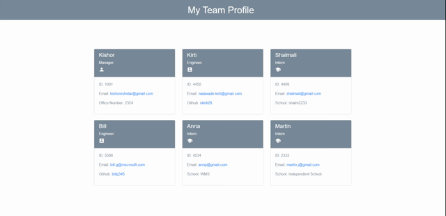

# Team Profile Generator

## Table-of-Contents

- [Description](#description)
- [UserStory](#user-story)
- [Installation](#installation)
- [Usage](#usage)
- [License](#license)
- [Tests](#tests)
- [Questions](#questions)

## [Description](#table-of-contents)

Team profile generator is a node command line application that takes in information about employees ebpage that displays summaries for each person.using the Inquirer package and generates an HTML webpage that summarizes for each person
Using this application it displays general information of employees and also easy to access their emails and github profiles.

## [User Story](#table-of-contents)

AS A manager
I WANT to generate a webpage that displays my team's basic info
SO THAT I have quick access to their emails and GitHub profiles

## [Installation](#table-of-contents)

Clone this repository to use this application.

## [Usage](#table-of-contents)

Run commands listed in Installation.

For more information on how to add screenshots for examples, visit the following website:

[Mark Down Tutorial](https://agea.github.io/tutorial.md/)

## [License](#table-of-contents)

The application is covered under the following license:
[MIT](https://choosealicense.com/licenses/MIT)

## [Contributing](#table-of-contents)

Thank you for your interest in helping out; however, I will not be accepting contributions from third parties.

## [Tests](#table-of-contents)

npm tests with jest package module

## [Questions](#table-of-contents)

Please contact me using the following links:

[GitHub](https://github.com/nkirti28)

[Email: nalawade.kirti@gmail.com](mailto:nalawade.kirti@gmail.com)
